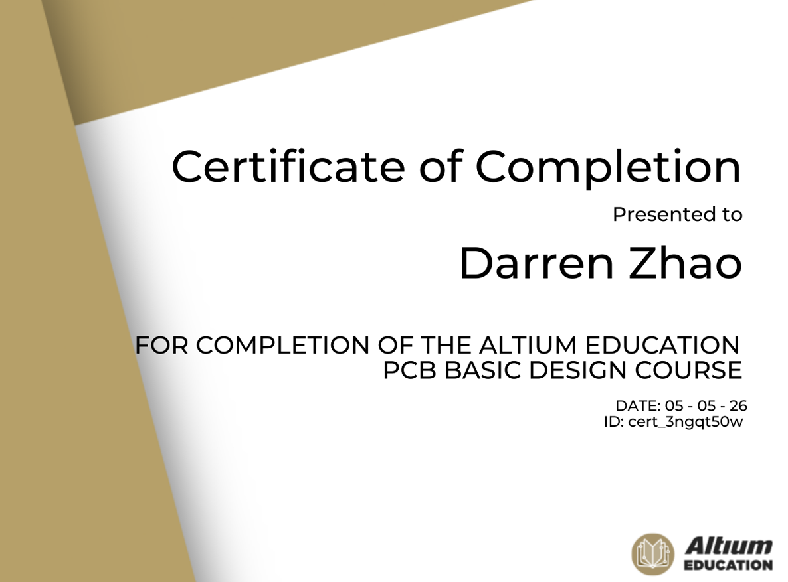

<h1>Hi, I'm Darren!</h1>

<h2>👨‍💻 Projects:</h2>
<ul>
  <li><a href="https://github.com/darrenz130/Arduino-Reaction-Time-Tester">Arduino Reaction Time Tester PCB Design</a></li>
  <li><a href="...">Elevator FPGA</a></li>
</ul>

<h2>📑 Certifications</h2>

<b>Altium Designer Basic PCB Design Certificate</b>

